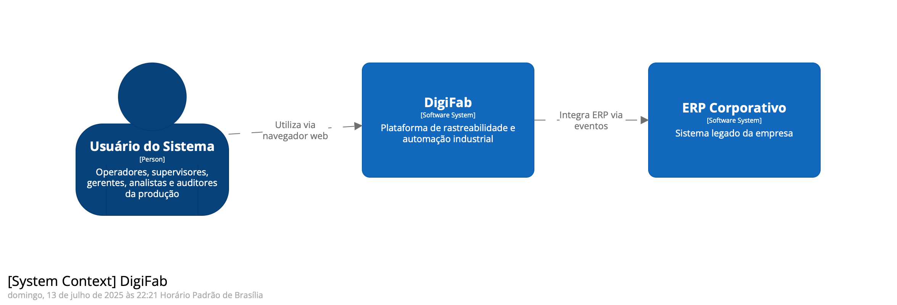
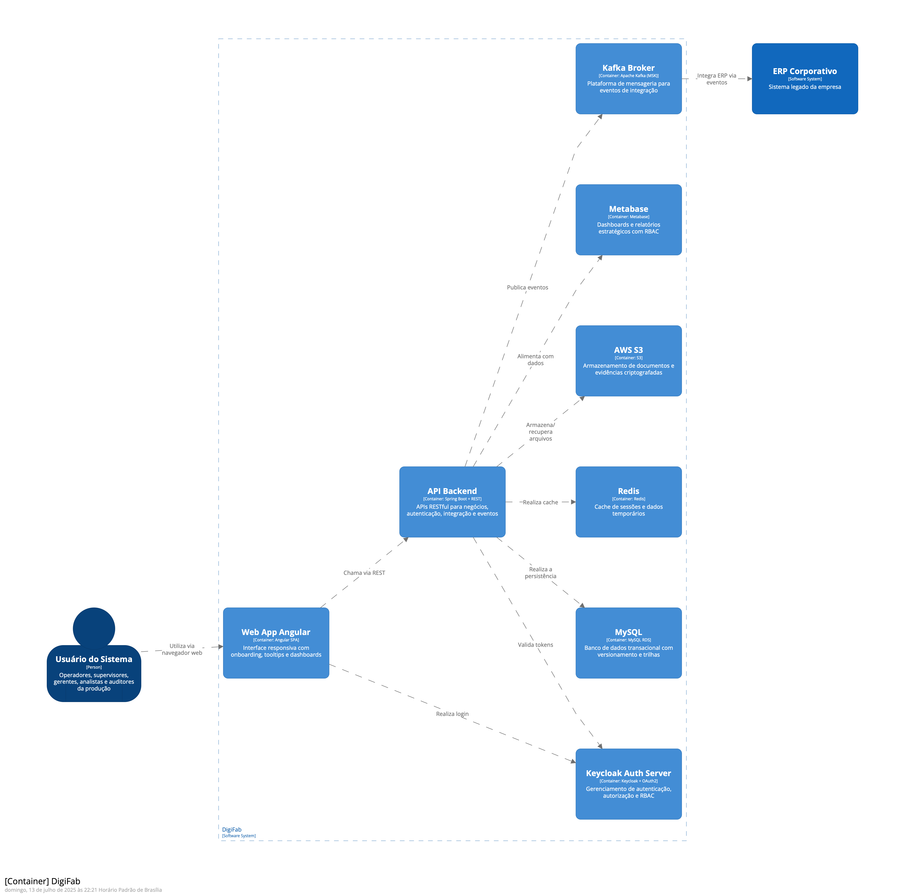
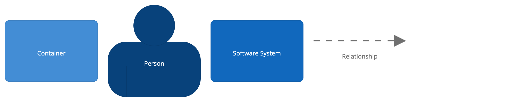

# 🧩 Instruções para Visualização do Modelo C4 com Structurizr DSL

Este documento explica como visualizar o modelo de arquitetura C4 descrito no arquivo [`c4-model.dsl`](../c4/c4-model.dsl), utilizando as ferramentas da plataforma Structurizr — tanto na versão local (Structurizr Lite) quanto via Web.


- [Requisitos](#-requisitos)
- [1. Usando o Structurizr Lite (local)](#️-1-usando-o-structurizr-lite-local)
- [2. Usando via Structurizr Web](#-2-usando-via-structurizr-web)
- [Offline](#3-offline-aqui)
- [Dicas adicionais](#️-dicas-adicionais)
- [Links úteis](#-links-úteis)
---

## ✅ Requisitos

- O arquivo [`c4-model.dsl`](../c4/c4-model.dsl) já deve estar disponível no seu projeto.
- Para uso local, é necessário o Java instalado na máquina (Java 8+).
- Opcionalmente, você pode utilizar o [Structurizr DSL Plugin para VS Code](https://marketplace.visualstudio.com/items?itemName=structurizr.vscode-structurizr) para edição e visualização parcial.

---

## 🖥️ 1. Usando o Structurizr Lite (local)

### Passo a passo:

1. **Baixe o Structurizr Lite**:
   - Acesse: [https://structurizr.com/help/lite](https://structurizr.com/help/lite)
   - Baixe o arquivo `.zip` e extraia o conteúdo em um diretório local.

2. **Copie o arquivo `.dsl`**:
   - Coloque o arquivo `c4-model.dsl` na pasta `workspace` dentro do diretório do Structurizr Lite.

   Exemplo de estrutura:
   ```text
   structurizr-lite/
   ├── structurizr-lite.war
   └── workspace/
   └── c4-model.dsl
   ```
3. **Execute o Structurizr Lite**:
- Via terminal, dentro do diretório `structurizr-lite`, execute:

  ```bash
  java -jar structurizr-lite.war
  ```

4. **Acesse no navegador**:
- Abra: [http://localhost:8080](http://localhost:8080)
- O modelo será carregado automaticamente.

---

## 🌐 2. Usando via Structurizr Web

> Requer login gratuito (ou pago) no site oficial da ferramenta.

### Passo a passo:

1. **Acesse** [https://structurizr.com](https://structurizr.com) e entre com sua conta.

2. **Crie um novo workspace** (ou use um existente).

3. Vá até a aba **"DSL"** no editor online.

4. **Copie e cole** o conteúdo do arquivo `c4-model.dsl` no editor.

5. Clique em **"Refresh diagrams"** para visualizar o modelo C4 completo.

---

## 3. Offline (aqui):
1. **Visão Geral do Sistema (Nível 1)**


2. **Visão de Container (Nível 2)**


3. **Legendas**


---

## 🛠️ Dicas adicionais

- O Structurizr DSL permite editar os diagramas em texto e visualizar diferentes níveis: **Contexto**, **Contêineres**, **Componentes** e **Código**.
- Para reusar estilos e configurações em múltiplos modelos, use arquivos `!include`.
- A versão local não exige conta nem internet — ideal para ambientes corporativos.

---

## 🔗 Links úteis

- 📚 [Documentação oficial do Structurizr DSL](https://structurizr.com/help/dsl)
- 🧪 [Playground online (Structurizr DSL)](https://structurizr.com/dsl)
- 🧰 [Structurizr Lite no GitHub](https://github.com/structurizr/lite)

---
