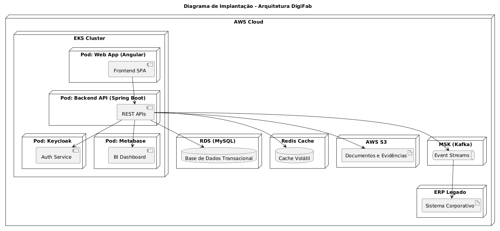

## Índice
- [Benefícios do Diagrama de Implantação](#-benefícios-do-diagrama-de-implantação)
- [Diagrama de Implantação](#️-diagrama-de-implantação)

## ✅ Benefícios do Diagrama de Implantação
- Ilustra a arquitetura distribuída dos componentes na nuvem AWS
- Mostra a organização de pods no EKS, comunicação com serviços externos (ERP, S3, Kafka)
- É útil para análise de segurança, segmentação de rede e validação de segregação de ambientes
- Apoia as equipes de DevOps, infraestrutura e segurança na orquestração da plataforma

## 🛰️ Diagrama de Implantação

