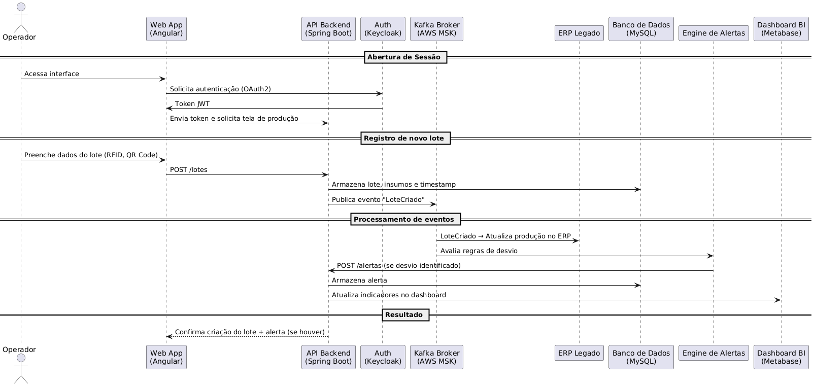

## Índice
- [Benefícios do Diagrama de Sequência](#-benefícios-do-diagrama-de-sequência)
- [Diagrama de Implantação](#-diagrama-de-sequência)

## ✅ Benefícios do Diagrama de Sequência
- Mostra claramente o fluxo de eventos em tempo real no registro e rastreamento de um lote
- Explicita a comunicação entre Web App, Backend, Kafka, ERP e Engine de Alertas
- Facilita o entendimento técnico para desenvolvedores, testadores e analistas de integração
- Ajuda a validar o comportamento do sistema diante de eventos e reações (ex: geração de alertas)

## 📊 Diagrama de Sequência

